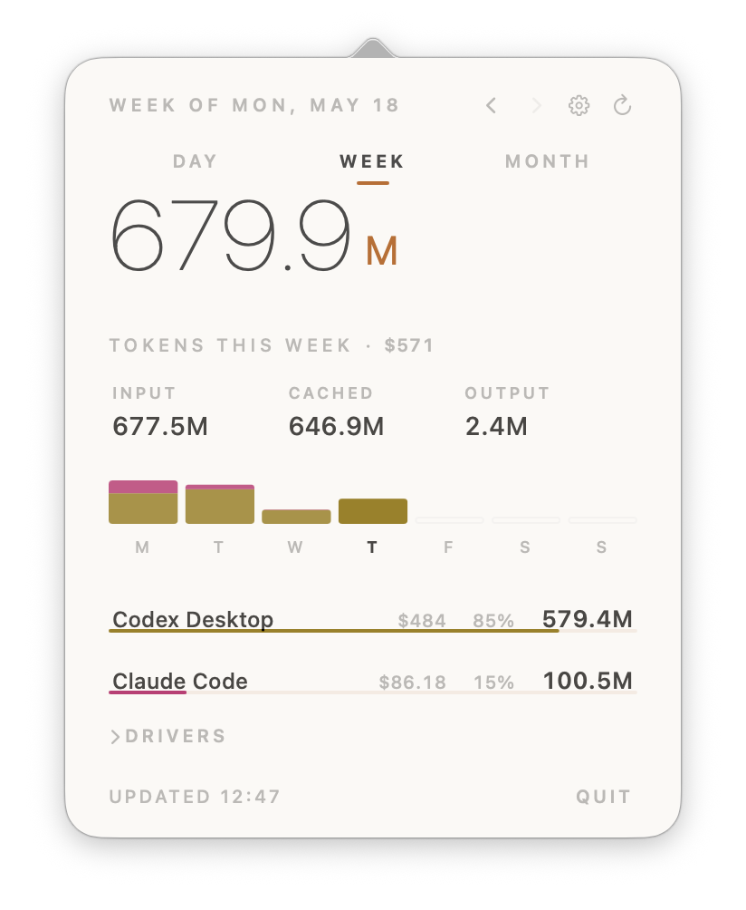

# TokenBar

TokenBar is a small native macOS menu bar app for local Codex and Claude Code token usage. It reads local JSONL usage history, summarizes tokens by period and tool, and shows API-equivalent cost estimates as a reference.

## Preview



It is not a billing source of truth.

## Features

- Menu bar popover with day, week, and month views.
- Local Codex usage from `~/.codex/sessions` and `~/.codex/archived_sessions`.
- Local Claude Code usage from `~/.claude/projects`.
- Provider path settings for non-default log locations.
- System, light, and dark appearance settings.
- Cache-first aggregation so unchanged session files are not reparsed on every open.
- Terminal summary mode for quick checks and scripts.

## Privacy

TokenBar reads usage logs from your local machine and writes its own config/cache under:

```text
~/Library/Application Support/local.tokenbar/
```

The app does not send usage data anywhere. Contributor/project identifiers stored in the cache are redacted with stable local hashes where path-derived names are needed.

## Requirements

- macOS 13 or newer
- Swift 6 toolchain

## Run From Source

```bash
swift run -c release
```

The app appears in the macOS menu bar with a chart icon and no Dock icon.

## Build A Double-Clickable App

```bash
zsh Scripts/build-app.sh
```

The script builds a release binary, assembles and ad-hoc signs:

```text
.build/release/TokenBar.app
```

It also creates a root `TokenBar.app` convenience copy for local Finder launches. Generated `.app` bundles are ignored by Git.

## Releases

Release builds are published as zipped app bundles on GitHub Releases. The repeatable release checklist is in [RELEASE.md](RELEASE.md).

## Terminal Usage

Print today's summary:

```bash
swift run -c release TokenBar --print-today
```

Print a selected period:

```bash
swift run -c release TokenBar --period week
swift run -c release TokenBar --period month --offset -1
```

Rebuild the local cache:

```bash
swift run -c release TokenBar --rebuild-cache
```

## Notes

- `cached_input_tokens` is already included in `input_tokens`; do not add it again.
- Codex usage is deduplicated across `sessions` and `archived_sessions` by session filename.
- The app refreshes when opened and every 5 minutes while running.
- Generated build output, app bundles, local assistant settings, and common local secret files are intentionally ignored.
